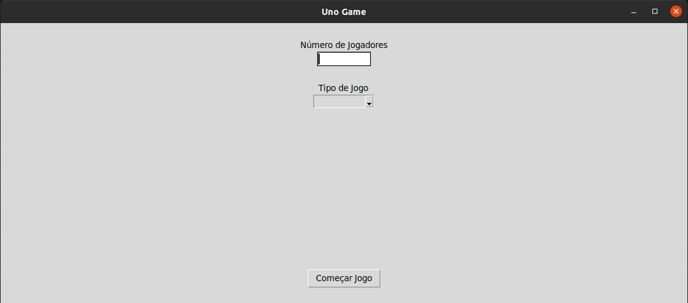

<h1>Jogo de Uno</h1>

O projeto que está sendo desenvolvido é um jogo de Uno simples para até 14 jogadores. A parte lógica e as estruturas de dados, em geral, estão sendo feitas usando C e a interface do usuário feita com Python. A princípio, o jogo será somente para pessoas jogarem entre si, mas tenho a ideia de, futuramente, implementar um modo em que você consiga jogar contra o computador.

## Interface
Até o momento a interface está muito simples e sem qualquer estilo, visto que estou focado em desenvolver primeiro todas as funcionalidades do jogo.

## Cartas
As cartas são exatamente as mesmas do Uno, assim como o mode de jogar:  

## Jogo

### Home

### Página do jogo

